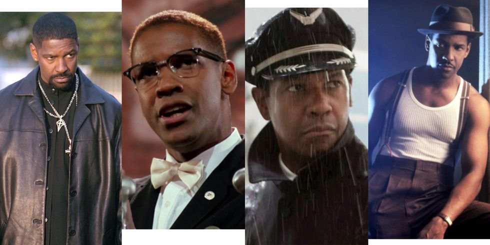
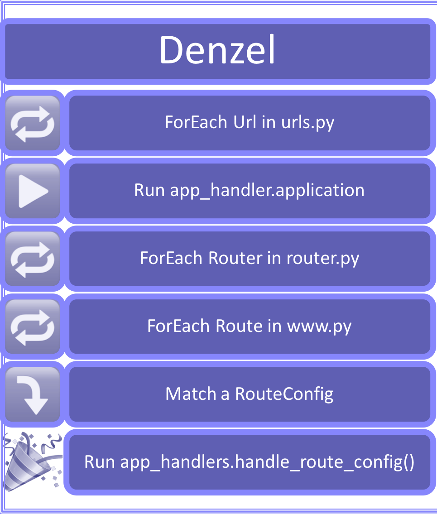
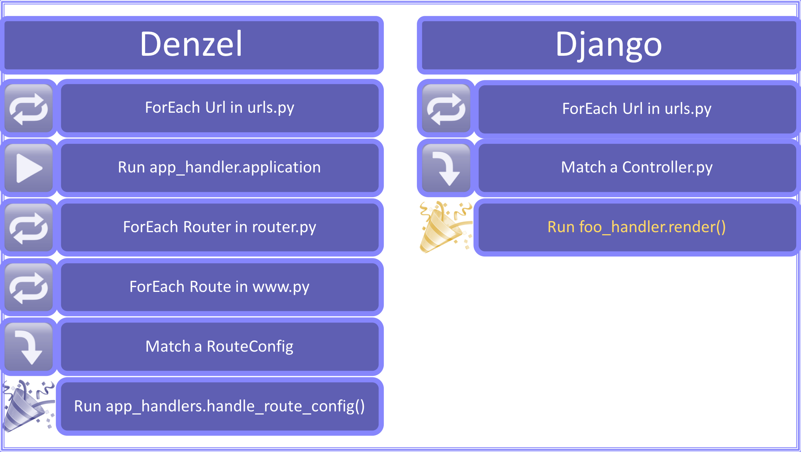
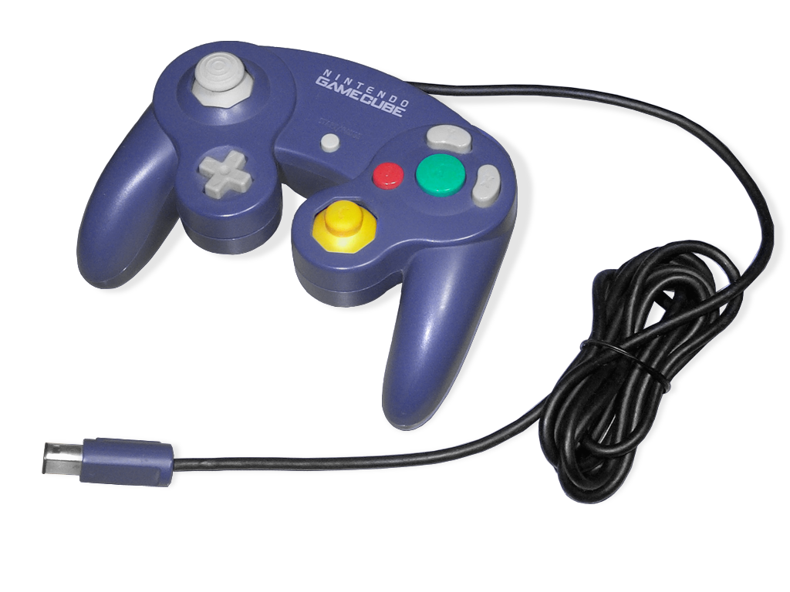
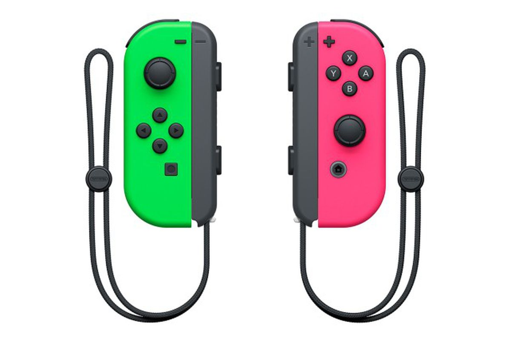

# [fit] webapp
# [fit] **controllers**

#### Ryan Albrecht
#### July 23, 2018


---

# [fit] Problem
# [fit] **1**

^ The first problem is that routes need to be put into the list ordered by how specific they are.

---

# Route Order

- `/about`
- `/community/:id`
- `...`
- `/:username/:boardSlug`
- `/:username/boards`
- `/videos`

^ Here's 5 routes, and 1 bug. The `/:username/:boardSlug` route will capture all requests to `/:username/boards` and serve the board called 'boards'. We will never see the list of boards that a user has!

---

# Route Order

- `...`
- `/:username/boards`
- `/:username/:boardSlug`
- `...`

^ The fix is simple. we need to re-arrange those two routes so the more specific one is first.

---

# Route Order

- `...`
- `/pin/:id/share`
- `/pin/featured/:id`
- `...`
- `/conversation/favorite/:id`
- `/conversation/:id/users`
- `...`

^ Here are four routes. What order should the routes be listed?

---

# [fit] Problem
# [fit] **2**



^ The second problem is our old framework, Denzel. Because of these route rules everything goes into denzel.

---



---

# Agenda

1. Why :white_check_mark:
1. **What's new**
1. Learnings

<!-- 1. Next steps -->


---

# [fit] **Controllers**


---

> simply a Python **function** that takes a Web **request** and returns a Web **response**.
-- Django (c. July 2005)

[.footer: ####*django calls them 'views']

^ https://docs.djangoproject.com/en/2.0/topics/http/views/
^ https://en.wikipedia.org/wiki/Django_(web_framework)

---

> responsible for making sense of the **request**, and producing the appropriate **output**.
-- Ruby on Rails (c. Dec 2005)

^ http://guides.rubyonrails.org/action_controller_overview.html
^ https://en.wikipedia.org/wiki/Ruby_on_Rails

---

> reads information from the **Request** object and creates and returns a **Response** object.
-- Symfony (c. Oct 2005)

^ https://symfony.com/doc/4.0/controller.html
^ https://en.wikipedia.org/wiki/Symfony

---

> handle interpreting the **request** data, making sure the correct models are called, and the right **response** or view is rendered.
-- CakePHP (c. April 2005)

^ https://book.cakephp.org/3.0/en/controllers.html
^ https://en.wikipedia.org/wiki/CakePHP

---

# [fit] **Controllers**
# are __NOT__ new


---

# Route Order?
# [fit] **1**

---

# Route Order:
# [fit] **`sorted()`**

---

# Route Order

- `...`
- `/pin/:id/share`
- `/pin/featured/:id`
- `...`
- `/conversation/favorite/:id`
- `/conversation/:id/users`
- `...`

---

# Dynamic Order

- `...`
- `PinFeaturedId.py`
- `ConversationFavoriteId.py`
- `PinIdShare.py`
- `ConversationIdUsers.py`
- `...`

---

# Agenda

1. Why
1. **What's new**
 - **Dynamic Route Order :white_check_mark:**
1. Learnings

<!-- 1. Next steps -->


---

# Denzel?
# [fit] **2**


---

# there is **no Denzel**


[.footer: ###*if you want]
---


---



---

# Agenda

1. Why
1. **What's new**
 - **Dynamic Route Order :white_check_mark:**
 - **Denzel is Optional :white_check_mark:**
1. Learnings

<!-- 1. Next steps -->



---

# [fit] **What**
# it looks like

---

```diff
--- webapp/routes/www.py
      pure_react=True)

+ r(r'^/m/search/$',
+    module=MessengerSearchExtension',
+    resource={
+        'name': 'SearchResource',
+        'options': {
+            'scope': 'pins',
+            'query': '?{q}',
+        },
+    },
+    hide_interstitial=True)
+
  r(r'^/m/pin/:id/$',
```

^ before May 10 2018

---

```diff
--- webapp/routes/www.py
+addC(r'^/m/search/', RouteConfig(
+    module='MessengerSearchExtension',
+    resource={
+        'name': 'BaseSearchResource',
+        'options': {
+            'scope': 'pins',
+            'query': '?{q}',
+        },
+    },
+    extra_context={
+        'hide_interstitial': True,
+    }))
+
```

^ From May to July, 2018

---

```diff
--- webapp/controllers/www/MSearchController.py
+class MSearchController(DenzelController):
+    @classmethod
+    def path(cls):
+        return r'^m/search/$'
+
+    def get_denzel_config(self, request, *args, **kwargs):
+        raise RouteConfig(
+            module='MessengerSearchExtension',
+            resource={
+                'name': 'BaseSearchResource',
+                'options': {
+                    'scope': 'pins',
+                    'query': '?{q}',
+                },
+            },
+            extra_context={
+                'hide_interstitial': True,
+            })
```

^ controllers, July 2018 and beyond

---

# What
# is
# this
# [fit] **magic!?**


---

```diff
--- webapp/denzel/DenzelController.py
+class DenzelController(BaseController):
+    @classmethod
+    def path(cls):
+        raise NotImplementedError()
+
+    def get_denzel_config(self, request, *args, **kwargs):
+        raise NotImplementedError()
+
+    def render(self, request, *args, **kwargs):
+        context = Context(request)
+        return app_handlers.handle_route_match(
+            context,
+            request,
+            self.get_route_args(context, request),
+            self.get_route_match(context, request))
```
---

```diff, [.highlight: 11-18]
--- webapp/denzel/DenzelController.py
+class DenzelController(BaseController):
+    @classmethod
+    def path(cls):
+        raise NotImplementedError()
+
+    def get_denzel_config(self, request, *args, **kwargs):
+        raise NotImplementedError()
+
+    def render(self, request, *args, **kwargs):
+        context = Context(request)
+        return app_handlers.handle_route_match(
+            context,
+            request,
+            self.get_route_args(context, request),
+            self.get_route_match(context, request))
```

^ the stuff that was in app_handlers.application() is now right here. We delegate down to handle_route_match().
^ converting a RouteConfig to a RouteMatch happens for you, but you can bring either type of object and still get a result back.

---

```diff, [.highlight: 3-8]
--- webapp/denzel/DenzelController.py
+class DenzelController(BaseController):
+    @classmethod
+    def path(cls):
+        raise NotImplementedError()
+
+    def get_denzel_config(self, request, *args, **kwargs):
+        raise NotImplementedError()
+
+    def render(self, request, *args, **kwargs):
+        context = Context(request)
+        return app_handlers.handle_route_match(
+            context,
+            request,
+            self.get_route_args(context, request),
+            self.get_route_match(context, request))
```

^ the stuff that was in app_handlers.application() is now right here. We delegate down to handle_route_match().
^ converting a RouteConfig to a RouteMatch happens for you, but you can bring either type of object and still get a result back.

---

# Agenda

1. Why
1. What's new
 - Dynamic Route Order
 - Denzel is Optional
1. **Learnings**

<!-- 1. Next steps -->


---

# Stats for nerds

| **77** Diffs | 340 Controller Files |
| ----- | ---- |
| **84** days (incl weekends + pto) | **4** abstract base controllers |
| **2** diffs at 1 line each | **196** www controllers |
| **13** diffs under 10 lines | **395** controllers total |
| **9** diffs over 1,000 lines | **30,305** lines touched |

---

# [fit] Small projects
# [fit] get **BIG**

^ Projects rarely get easier than we thought, only harder.

---

# [fit] Big projects get
# [fit] **HUGE**

^ If projects do get easier, that's great we can all go play mario. When they run long though, you're in trouble.

---

# [fit] LEVERAGE
## **smaller**
# [fit] SCOPE

^ Smaller diffs are good, even better are experiments/prototypes. Get shipping code, ship a small cow then iterate!

---

# [fit] **1. Analytics**
# [fit] 2. Eval
# [fit] **3. Sterling**
# [fit] 4. WWW

^ By doing the work on Analytics, Eval, Sterling, then WWW we were able to test out different things are take on complexity incrementally. Each site has it's own special considerations so by doing the smaller ones first we can make sure that we can handle that complexity.
^ Figure out what we will need to solve for, then incrementally get there with one route at a time.

---

# [fit] **1. Analytics :heart:**
# [fit] 2. Eval :heart:
# [fit] **3. Sterling :heart:**
# [fit] 4. WWW :heart:

^ Special thanks to all the people on analytics, eval and sterling who got sucked in and helped review diffs and identify & make fixes.
^ The more different these four apps are the harder it is, but we've removed a few of those differences now for the better.


<!--

---

# [fit] **Next**
# Steps

 -->


<!--
---

- non-denzel handlers
- multi-part data flushing
- scoped data and react.render() code
- cacheable html skeleton
- non-resource ajax responses -->

---

## More reading

- [Simplifying URL to View Mapping in Pinboard] (https://docs.google.com/document/d/1f4uakRERtxIf6n3J64UO0nzzJY5AEJ8g6t-dDSKacVE/edit?usp=sharing)
- [Future webapp/ Capabilities Brainstorm](https://docs.google.com/document/d/10LdHEg6YE5gtLaX3YkKmM-LCUxZ_pIgQ2M3ktweSFZg/edit?usp=sharing)
- [Growth Web Service Architecture Roadmap H2 2018](https://docs.google.com/document/d/1yJ3GjsECHNF8cgrDj4jPVDPoU7_LXdgAqE2I7IUmz-4/edit?usp=sharing)
- [Controller Project Diff Tracking](https://docs.google.com/spreadsheets/d/1iM1mdiLUQt4uzZP_55Zso6NZMNGtFPCs58IeYmEJh2A/edit?usp=sharing)

[.footer: _the end_]


<!--

^ 
^ https://www.ubreakifix.com/blog/game-console-controller


^ https://www.deviantart.com/rootay/art/Minimalist-Controller-Evolution-548576101

-->


<!--


^ https://consequenceofsound.net/2018/07/denzel-washingtons-top-10-performances/
-->
